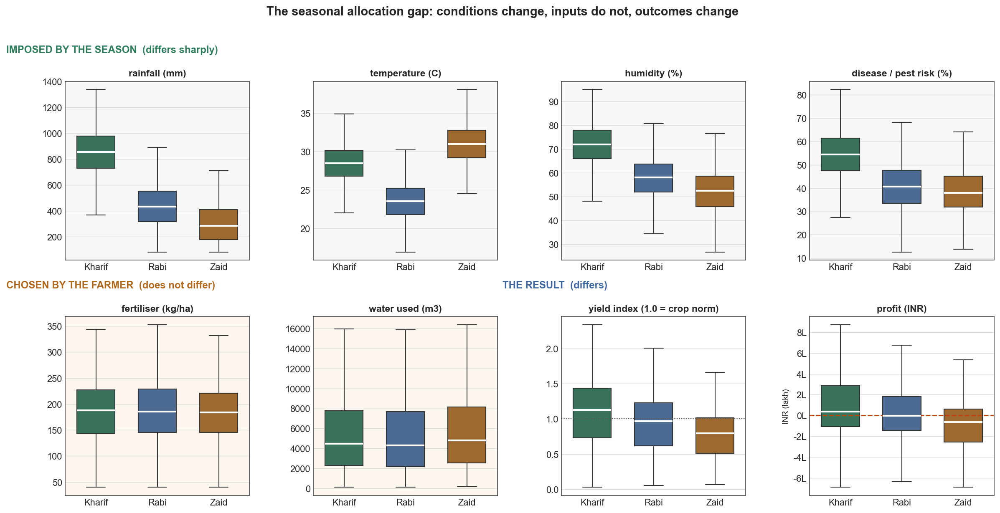
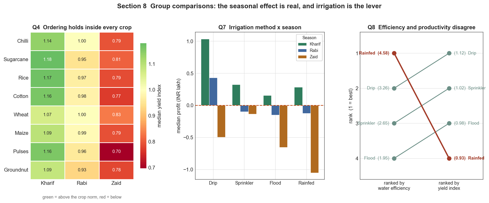
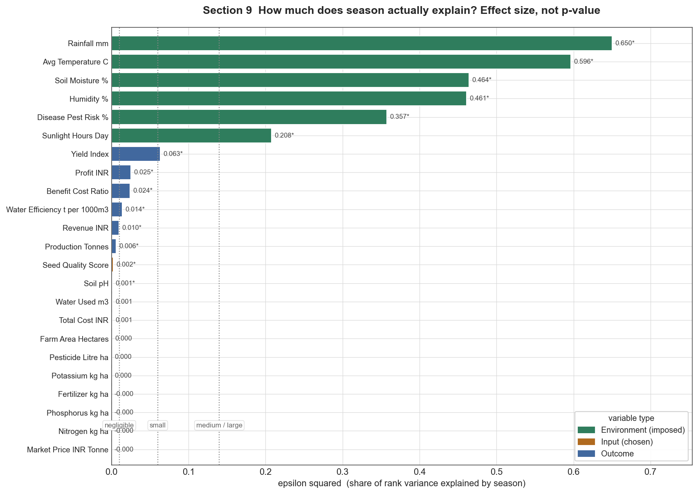
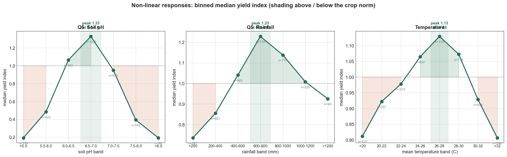
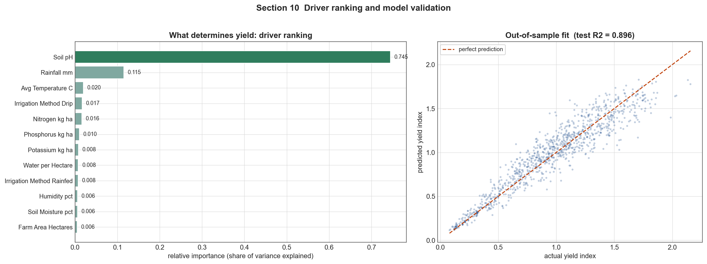

<h1 align="center">Seasonal Agriculture Performance Analysis</h1>

<p align="center">
  <em>Indian farms earn a median profit of ₹38,808 in Kharif and lose ₹62,144 in Zaid.<br>
  They spend almost exactly the same amount in both. This is an analysis of that gap.</em>
</p>

<p align="center">
  
  
  
  
  
  <a href="https://colab.research.google.com/github/AmanKumar-23/seasonal-agriculture-performance-analysis/blob/main/Seasonal_Agriculture_Performance_Analysis.ipynb">
    </a>
</p>

---

## The question

Indian agriculture runs on three cropping seasons. **Kharif** is the monsoon crop, sown with the
June rains. **Rabi** is the winter crop, grown on residual moisture and irrigation. **Zaid** is the
short, hot summer crop squeezed between them.

Everyone in Indian farming knows the seasons perform differently. Almost nobody can say *by how
much*, *why*, or *what to do differently* — because the answer is buried in farm records that
were never analysed as a seasonal question.

This project analyses **4,000 farm records across 28 attributes** to answer exactly that:

> **How and why does agricultural performance differ between Kharif, Rabi and Zaid,
> and what should be done about it?**

---

## The headline finding



Read the figure left to right along the bottom row and the argument is complete in one image.

The **top row** is what the season does to the farm: rainfall, temperature, humidity and disease
pressure separate the three seasons sharply. The **bottom-left pair** is what the farmer does about
it: fertiliser and water applied at effectively identical levels in all three seasons. The
**bottom-right pair** is the consequence: yield and profit falling season by season, with Zaid
sitting well below break-even.

*Identical effort. Different conditions. Different results.*

The gap is not caused by farmers under-investing in the hard seasons — **investment is flat**. It is
caused by identical investment buying far less under Zaid conditions than under Kharif conditions.
That reframes the problem entirely: this is not a weather problem, it is an **allocation problem**,
and unlike the weather, allocation is something that can actually be changed.

---

## Results at a glance

| Measure | Kharif | Rabi | Zaid | Test |
|---|---:|---:|---:|---|
| Median yield index *(1.00 = crop norm)* | **1.13** | 0.97 | 0.79 | H = 254.1, p = 6.5e-56 |
| Median profit | **₹38,808** | −₹3,187 | −₹62,144 | H = 101.9, p = 7.4e-23 |
| Benefit–cost ratio | **1.12** | 0.99 | 0.80 | H = 98.1, p = 5.1e-22 |
| Loss-making farms | **42.2 %** | 51.1 % | 64.5 % | χ² = 92.7, p = 7.6e-21 |
| Rainfall (mm) | 852 | 436 | 299 | H = 2558.6, p < 0.001 |
| Fertiliser (kg/ha) | 187.1 | 185.4 | 184.6 | **p = 0.59 — no difference** |

**49.1 % of all farms in the dataset lose money.** The seasonal question is about how much worse
those odds get from a baseline that is already close to a coin flip.

---

## Five findings that survived scrutiny

### 1 · The seasonal effect is real, not a crop-mix artefact



The obvious objection to the headline is Simpson's paradox: if each season plants a different mix of
crops, a "seasonal" effect could be nothing more than a crop effect wearing a season's name.

It isn't. Crop shares differ between seasons by at most **3.4 percentage points**, and the
Kharif > Rabi > Zaid ordering reproduces **inside all 8 crops** on both yield and profit. A
composition artefact appears in the pooled average and vanishes within strata; here the opposite
happens. The finding stands.

### 2 · Season explains the environment, not the inputs



**7 of 7** environmental variables differ significantly by season — **six of them with large
effect sizes**. Soil pH is the lone exception: significant, but at ε² = 0.0011, the same
negligible band as the farmer inputs. That is what a variable which is genuinely *not* seasonal
looks like, and it is a useful check that the effect-size column is doing real work.

Of 8 farmer-controlled inputs, effect sizes are **negligible** across the board.

Effect sizes matter here more than p-values. At n = 4,000 a difference far too small to matter on any
real farm still returns p < 0.05, so every test in this project reports ε² or rank-biserial
correlation beside its p-value. Without that, the chart above would read "everything differs" —
true, and useless.

### 3 · A correlation matrix would have missed the strongest driver



Soil pH correlates with yield at **ρ = −0.0002 (p = 0.99)**. Taken at face value, soil acidity is irrelevant.

But farms in the 6.5–7.0 band out-yield farms at the extremes by **6.9×**. Both facts are correct:
the response is an **inverted U**, yield climbs to a near-neutral optimum and falls away on either
side, and a monotonic statistic averages the two halves into nothing.

Screening features by correlation — a common and superficially reasonable shortcut — would have
discarded the single strongest predictor in this dataset before modelling began.

### 4 · Rainfall helps in two seasons and hurts in the third

Rainfall vs yield, computed **within** each season:

| | Pooled | Kharif | Rabi | Zaid |
|---|---:|---:|---:|---:|
| Spearman ρ | +0.24 | **−0.19** | +0.27 | +0.31 |

In Kharif the monsoon has already delivered abundant water, so additional rain means waterlogging,
nutrient leaching and sharply higher disease pressure. In Rabi and Zaid water is the binding
constraint and rain relieves it. The pooled coefficient averages two opposite effects into a number
that describes a farm existing in neither season.

Consequence: **Kharif planning needs drainage; Rabi and Zaid planning needs delivery.**

### 5 · The dataset's own efficiency metric is misleading

Water efficiency is production ÷ water used. Water sits in the denominator, so the ratio is
maximised either by producing more **or simply by using less**:

| Irrigation | Water efficiency | Rank | Yield index | Rank | Median profit |
|---|---:|:--:|---:|:--:|---:|
| Rainfed | **4.58** | 🥇 1st | 0.93 | 4th | −₹9,650 |
| Drip | 3.26 | 2nd | **1.12** | 🥇 1st | **₹52,895** |
| Sprinkler | 2.65 | 3rd | 1.02 | 2nd | ₹7,840 |
| Flood | 1.95 | 4th | 0.98 | 3rd | −₹12,131 |

A KPI written as "raise water efficiency" is satisfied by irrigating less and harvesting less. If the
intent is more crop per drop, the target must pair efficiency with an absolute yield or profit floor.

---

## What drives yield



A Random Forest trained on environment, inputs and practice — deliberately **excluding** every
column arithmetically linked to the target — reaches **R² = 0.896** out of sample.

Its ranking disagrees with the correlation table, and that disagreement is the point: a decision tree
can split on either side of an optimum, while a correlation coefficient must average across it.

---

## Method

The analysis runs as a single Jupyter notebook in 11 stages:

| # | Stage | What it establishes |
|---|---|---|
| 0–1 | Setup, structural profile | Shape, types, cardinality; 28 columns mapped to 6 content families |
| 2 | **Integrity audit** | Four arithmetic identities; missingness mechanism; censoring; plausibility |
| 3 | Cleaning, feature engineering | Principled repair; `Yield_Index`, BCR, per-hectare economics |
| 4 | Research questions | 10 specific, testable questions formulated after first exploration |
| 5 | Univariate EDA | Distribution shape; the median-and-non-parametric decision |
| 6 | **Seasonal comparison** | The core contrast: conditions move, inputs don't, outcomes move |
| 7 | Relationships | Non-linearity, within-season interactions, the disease chain |
| 8 | Group comparisons | Crop, irrigation, geography; Simpson's paradox ruled out |
| 9 | Significance testing | Kruskal–Wallis, Mann–Whitney U + Bonferroni, χ², with effect sizes |
| 10 | Drivers and conclusions | Model-based ranking, recommendations, limitations |

### Three decisions worth calling out

**Missing yields were recovered, not imputed.** The audit proved `Production = Area × Yield` holds on
100% of rows, so all 32 missing yield values were restored exactly by division. No mean-filling, no
distortion of the distribution.

**No model uses an accounting identity.** `Revenue`, `Profit`, `Production` and `Water_Efficiency` are
algebraic restatements of other columns. Predicting profit from revenue and cost returns R² = 1.000
and discovers subtraction. The model targets yield, from environment and inputs only.

**Yield is indexed to its own crop.** Sugarcane's median yield is 48.03 t/ha; pulses' is 0.94 t/ha.
Raw cross-crop comparison measures which crop was planted, not how the farm performed. Every
cross-crop and cross-season statement uses `yield ÷ crop-median-yield`.

---

## Repository structure

```
seasonal-agriculture-performance-analysis/
├── Seasonal_Agriculture_Performance_Analysis.ipynb   # the analysis — 76 cells, fully executed
├── data/
│   └── seasonal_agriculture_performance_dataset.csv  # 4,000 farms × 28 attributes
├── figures/                                          # 8 exported charts, PNG at 150 dpi
├── requirements.txt
├── LICENSE
└── README.md
```

---

## Getting started

**Fastest — no install:**
[](https://colab.research.google.com/github/AmanKumar-23/seasonal-agriculture-performance-analysis/blob/main/Seasonal_Agriculture_Performance_Analysis.ipynb)

The notebook carries a compressed copy of the dataset internally, so it runs end to end in Colab with
no upload step. It still prefers the real CSV whenever one is present, and always prints which source
it used.

**Locally:**

```bash
git clone https://github.com/AmanKumar-23/seasonal-agriculture-performance-analysis.git
cd seasonal-agriculture-performance-analysis
pip install -r requirements.txt
jupyter lab Seasonal_Agriculture_Performance_Analysis.ipynb
```

Then **Run → Run All Cells**. Roughly 90 seconds end to end. Tested on pandas 2.2 / NumPy 1.26 and
pandas 3.0 / NumPy 2.4 — identical results on both.

---

## Recommendations

| # | Recommendation | Evidence |
|---|---|---|
| 1 | **Stop allocating inputs uniformly across seasons.** The marginal rupee is worth more in Kharif; subsidy and extension schedules should be season-differentiated. | §6, §9 |
| 2 | **Reduce Zaid planting of crops that lose money in every season.** Fallow beats a predictable loss. | §8 |
| 3 | **Prioritise conversion away from flood irrigation.** Drip delivers more yield and profit on 27% less water. | §8, §9 |
| 4 | **Test and correct soil pH before increasing fertiliser.** pH tops the driver ranking; nutrients are unavailable outside its band. | §7, §10 |
| 5 | **Match water strategy to season.** Drainage in Kharif, delivery in Rabi and Zaid. | §7 |
| 6 | **Scale plant protection to seasonal disease pressure**, via timed monitored application rather than blanket volume. | §7 |
| 7 | **Rewrite the water-efficiency KPI** before using it to set targets. | §8 |

---

## Limitations

Stated plainly, because several of them constrain how far these conclusions travel.

- **No time dimension.** There is no date column. Every comparison is cross-sectional — a contrast
  between farms observed in different seasons, not change over time. "Trend" here means that
  gradient, never year-on-year movement.
- **Geography is not real.** Every district appears under multiple states, so `State` and `District`
  are independent random labels. They test as non-significant (p = 0.31, 0.28) and **no regional
  claim is made** — a league table built on this data would rank noise.
- **The cropping calendar is not agronomically valid.** Wheat appears in Kharif; sugarcane spans all
  three seasons. Findings describe responses to seasonal *conditions*, not planting advice.
- **Yield and rainfall are left-censored**, piling up at exact minima, so the lower tail is flatter
  than reality.
- **Zaid is under-sampled** at 14.9% of rows; group sizes are printed beside every three-way table.
- **All findings are associational.** Observational data, no randomisation, no causal claim.
- **The dataset appears synthetic.** Exact arithmetic identities, clean bounds and scrambled
  geography all point that way. The *methods* transfer to real survey data; the *numbers* should not
  be quoted as facts about Indian agriculture.

---

## Tech stack

`Python 3` · `pandas` · `NumPy` · `SciPy.stats` · `scikit-learn` · `Matplotlib` · `Seaborn` · `Jupyter`

---

## Author

**Aman Kumar** — Faculty of Technology, University of Delhi
VOIS for Tech · AICTE Batch 1 · 2026–2027 Major Project

## License

[MIT](LICENSE)
